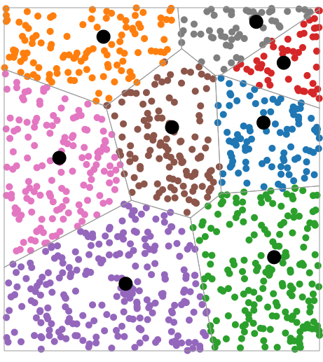

# KMeans
**Aprendizagem não supervisionada**.  
Trabalha com Cluster que basicamente tentam achar um valor de K e vai classificando as informações com base nisso.  
  
Esse processo é capaz de separar informações que nem conhecemos.  
  
Grupo de idosos, fumantes, mulheres etc. A máquina vai procurando características e separando.  
  
O algoritmo tenta encontrar um centro em cada grupo, de forma que fique o mais próximo possível de todos do seu grupo.  
  
http://alekseynp.com/viz/k-means.html  

  
  
1. Escolhemos aleatoriamente k protótipos (centros) para os clusters
2. Atribuir cada objeto para o cluster de centro mais próximo (segundo distância euclidiana)
3. Mover cada centro para a média (centróide) dos objetos do cluster correspondente
4. Repetir os passos 2 e 3 até que algum critério de convergência seja obtido
  
Configuramos um número máximo de iterações e limiar mínimo de mudanças de centróides.  
  
Obs: KMeans funciona com 2 atributos, 2 dimensões, o que é uma desvantagem por ser simples demais.  
  
## Vantagens
- Simples e intuitivo
- Complexidade computacional linear em todas as variáveis críticas
- Eficaz em muitos cenários de aplicação e produz resultados de interpretação simples

## Desvantagens
- k = ?
- Sensível à inicialização dos protótipos (mínimos locais)
- Limita-se a encontrar clusters volumétricos / globulares
- Cada item deve pertencer a um único cluster (partição rígida, ou seja, sem sobreposição)
- Limitado a atributos numéricos
- Sensível a outliers

