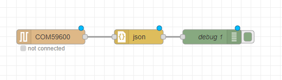

# NodeRed - Usando ServoMotor
```
#include<DHT.h>
#include<Servo.h>
#include<ArduinoJson.h>

#define DHTPIN 4
#define DHTTYPE DHT11
#define servoPin 3
#define ledR 12
#define ledG 13

DHT dht(DHTPIN, DHTTYPE);
Servo myServo;

void setup() {
  dht.begin();
  pinMode(servoPin, OUTPUT);
  myServo.attach(servoPin);
  pinMode(ledR, OUTPUT);
  pinMode(ledG, OUTPUT);
  Serial.begin(9600);
  
}

void loop() {
  int temp = dht.readTemperature();
  int umi = dht.readHumidity();

  if(Serial.available() > 0){
    char comando = Serial.read();
    if(comando == '1'){
      myServo.write(180);
      delay(5000);
    }else if(comando == '0'){
      myServo.write(0);
      delay(5000);
    }

  }

  if(temp >= 30 && temp < 40){
    myServo.write(0);
    delay(1000);
    myServo.write(180);
    delay(1000);
    digitalWrite(ledR, LOW);
    digitalWrite(ledG, HIGH);
    delay(500);
    digitalWrite(ledG, LOW);
    delay(500);
    //Serial.println(temp);
    //Serial.println(umi);
    
   
  }else if(temp > 40){
    digitalWrite(ledR, HIGH);
    digitalWrite(ledG, LOW);
    //Serial.println(temp);
    //Serial.println(umi);
  
  }else{
    digitalWrite(ledG, HIGH);
    digitalWrite(ledR, LOW);
    //Serial.println(temp);
    //Serial.println(umi);
  }

  StaticJsonDocument<100>json;

  json["Temperatura"] = temp;
  json["Umidade"] = umi;

  serializeJson(json, Serial);
  Serial.println();
  delay(2000);
}

```

Na aula temos uma placa arduíno em que configuramos sensores de temperatura e umidade (DHT), servo motor e LEDs vermelhas e verdes.

0. Configuramos o arduíno na IDE e conectamos com a COM da placa arduíno
    * 
1. Iniciar node-red com o comando `node-red` no cmd
2. Instalar extensão pesquisando por 'serial'
    * 
3. Instalamos a lib DHT11 de sensor da Adafruit
    * 
4. Instalamos a lib de Arduíno JSON
    * 
5. Obs: Ao alterar o código precisamos ir no NodeRed e trocar a porta do COM para desconectar
6. Compilamos o código arduíno novamente
7. Iniciamos o Deploy no NodeRed novamente
8. Configuração do ChageNode
    * 
9. Adicionando Gause e Chart no NodeRed
    * 
    * 
10. Gráfico aparecendo em localhost:1880/ui
    * 
11. Configurando buttons para enviar sinais ao ServoMotor
    * 
12. Configurando MQTT para enviar sinais - Acessando https://www.hivemq.com/demos/websocket-client/
13. Podemos usar MyMQTT também
14. No NodeRed basta criar um MQTT OUT e configurar como server: mqtt-dashboard.com - Texto do site
15. Configuramos um tópico no NodeRed, tipo fiap/iot/gkazukionishi. E lá no site nos subscrevemos no tópico 
    * 
    * 
16. Obs: Podemos configurar um MQTT In também, em que enviamos para o Arduíno.
17. Vamos agora acessar o TagoIO para enviar para a Cloud via HTTP
18. Configuramos um Device de Custom HTTPS
19. Cada um vai ter um token
20. Vamos criar uma Action:
    * Variable - Chamar de Ação
    * Tipo - Post data to endpoint using HTTP
    * Http - https://api.tago.io/data
    * Criamos
    * Single device
    * Selecionamos o device
    * Escolhemos uma variável - temperatura is Anything
21. Vamos no NodeRed e adicionamos um function
```
msg.headers = {
    'Device-Token':'', --> Aqui colocamos o Token do devide que configuramos
    'Content-Type':'application/json'
};

var action = [
    {
        'variable':'Temperatura',
        'unit':'cm',
        'value':msg.payload.Temperatura,
    }
]

msg.payload = action

return msg;
```
22. Podemos então visualizar o que chega e exportar as informações em um CSV, por exemplo