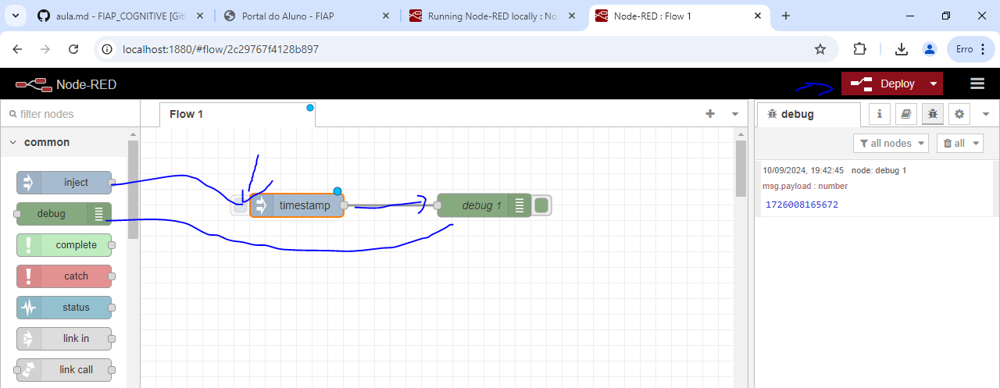
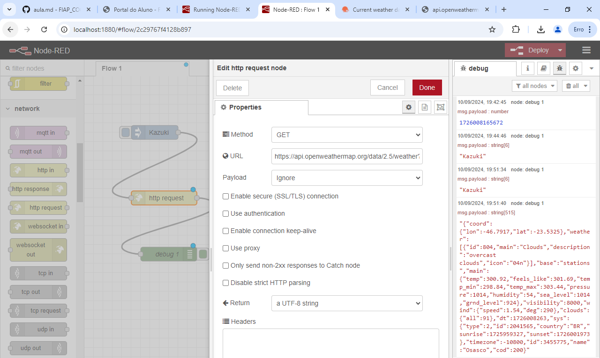
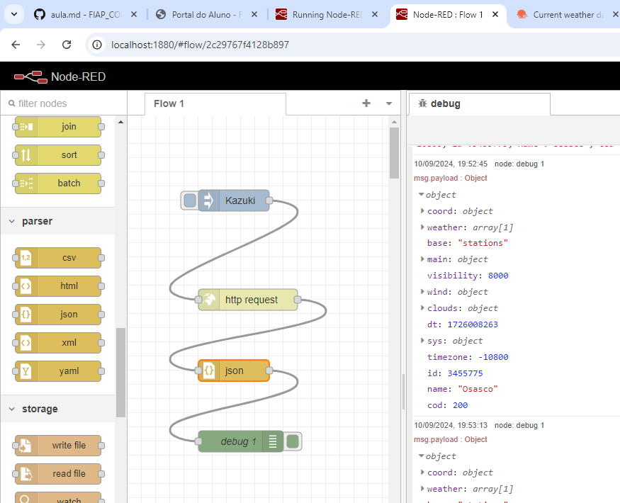
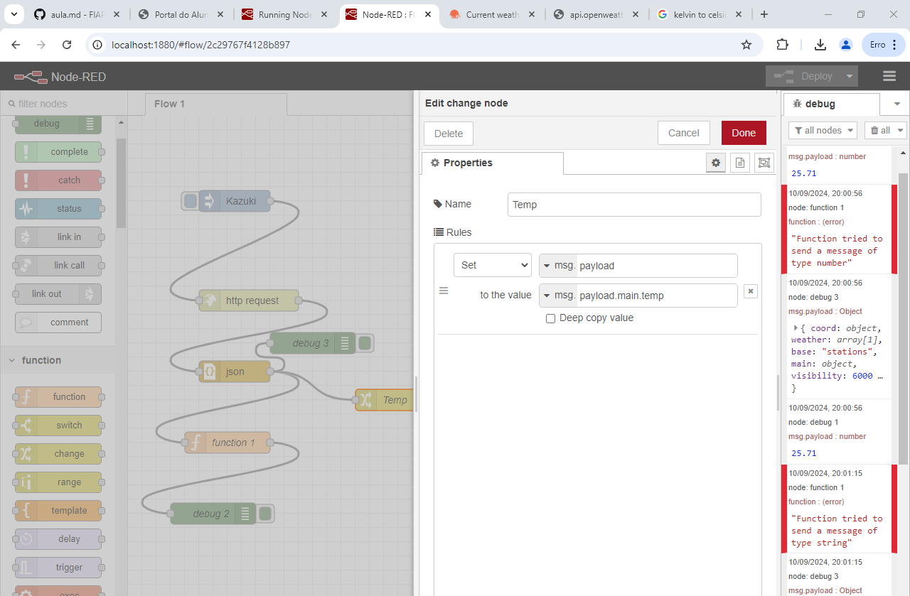
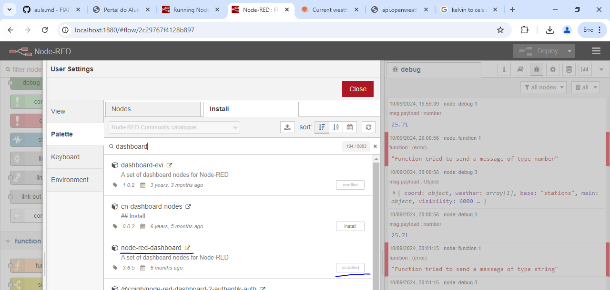
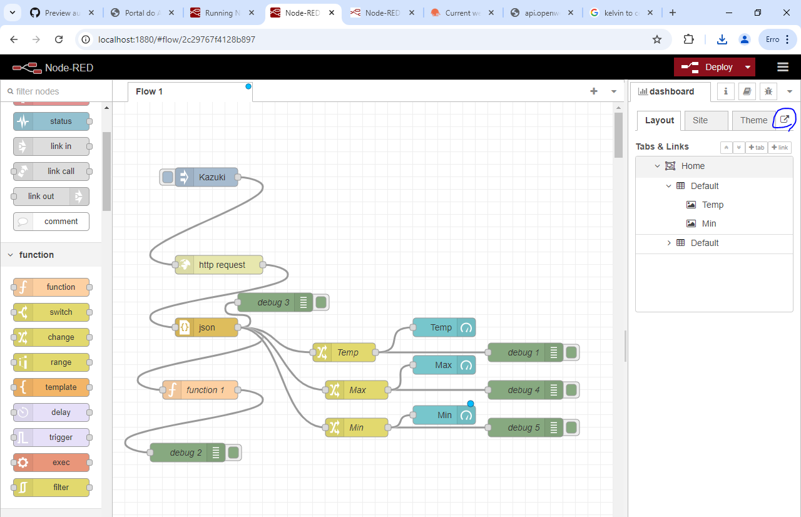
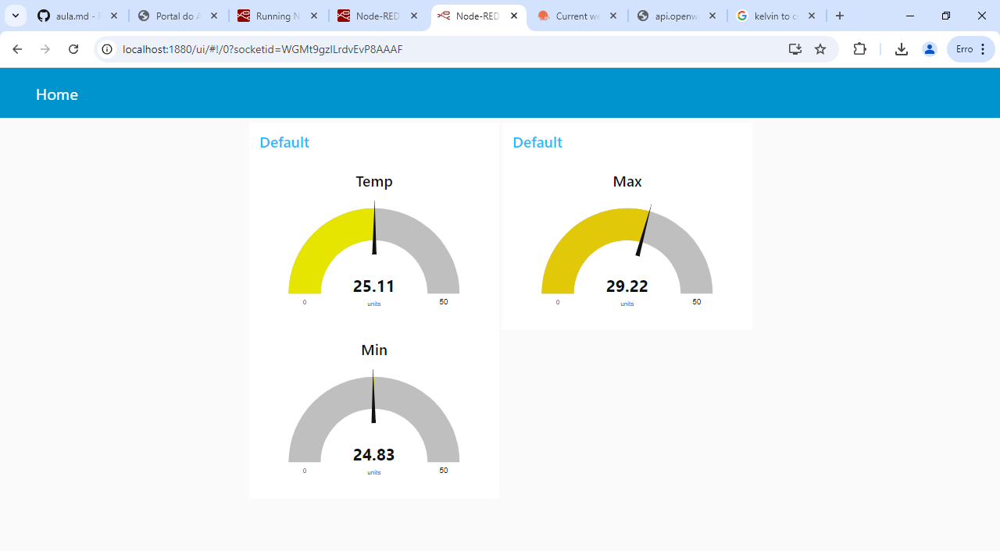
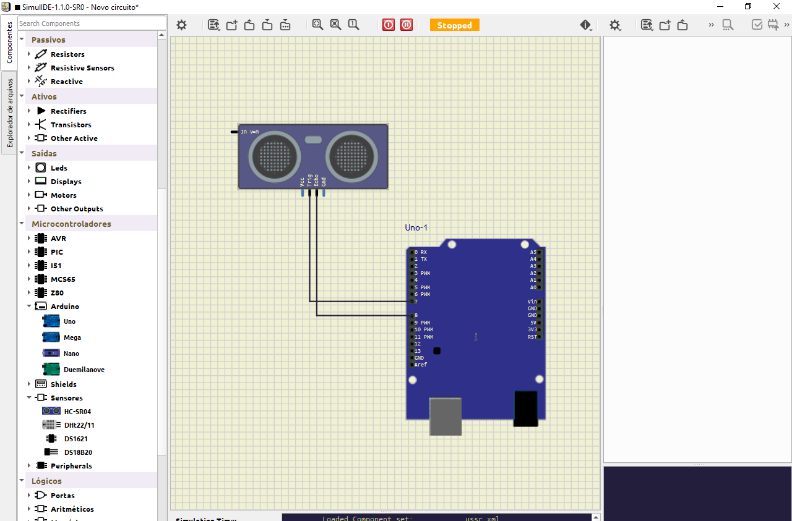
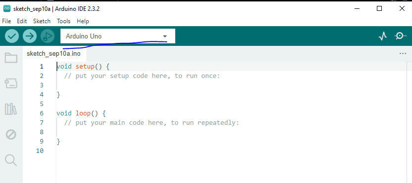
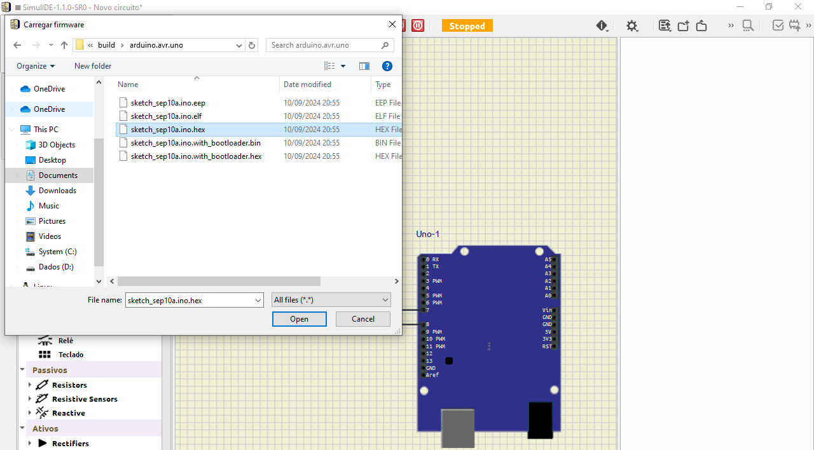

# Iot com Node Red
Qualquer dispositivo IoT permite conexão com sistemas, permitindo se comunicar com servidores, enviar mensagens etc.  
  
Arduíno permite controlar dispositivos, e quando usamos ele junto de Visão Computacional, IA ou outros, abre um leque de possibilidades.  
  
Protocolos:
* HTTP
* MQTT -> 1883
* WebSocket -> 8884
  
Dados podem ser armazenados em bancos NoSQL ou outros, além de Gateways que são comuns.  
  
IPv4, IPv6, Bluetooth etc.  
  
Tudo que vai chegando nos servidores podemos visualizar.  
  
## Node-RED e Node.js

Comando de instalação: `npm install -g --unsafe-perm node-red`  
  
Rode: `node-red` no CMD como Admin. Isso já vai iniciar o nosso back-end de forma local
  
Acesse: `localhost:1880`. Aqui temos o NodeRed rodando.
  
Ele permite de forma low-code uma integração muito fácil de diferentes dispositivos uns com os outros.  
















Obs: Importar arquivos flows.json etc.  

## SimulIDE - Simulador de Arduíno
TinkerCad não consegue se conectar com o NodeRed, por isso vamos usar ele.  
  

  
Abra agr o Arduíno IDE.  

Configue o Arduíno UNO em 

```
int trigger = 7;
int echo = 8;
int dist = 0;

void setup() {
  // put your setup code here, to run once:
  pinMode(trigger, OUTPUT);
  pinMode(echo, INPUT);
  Serial.begin(9600);
}

void loop() {
  // put your main code here, to run repeatedly:
  digitalWrite(trigger, LOW);
  delayMicroseconds(5);
  digitalWrite(trigger, HIGH);
  delayMicroseconds(10);
  digitalWrite(trigger, LOW);
  
  dist = pulseIn(echo, HIGH);
  dist = dist / 58;

  Serial.println(dist);
}
```
  
Compile o código.  
  
Aperte em Export Compiled Binary.  
  
Ir onde o build está e importar lá no SimulIDE, clique na placa, em main, vá em carregar firmware.



Depois dê start e na placa, em main, configure o início da Serial.  
  
Depois Stop.  
  
