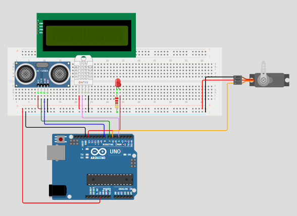

# Aula - Arduíno
Modelo:  


Lembrar que:
* Positivo - 5V
* Negativo - GND
* Portas digitais de escolha
* Resistor de 220 Ohns
* Porta torta do LED é positiva
* Na protoboard as 2 linhas de baixo ou de cima energizam horizontalmente, então só precisa energizar uma linha positiva e uma negativa, depois usar
* DHT:
    * Esquerda é positiva considerando ele para baixo
    * Direita é negativo
    * Segunda é digital
    * Terceira não usa
* ServoMotor
    * Marrom: Negativo
    * Vermelho: Positivo
    * Laranja: PWM - Alguma porta com ~

## Libs
#include<Servo.h>
#include<DHT.h>

## Código

```
#include<Servo.h>
#include<DHT.h>

#define led 13
#define trigger 7
#define echo 8
#define DHTPIN 4
#define DHTTYPE DHT11
#define ServoPin 6
int dist = 0;

DHT dht(DHTPIN, DHTTYPE);
Servo myServo;

void setup() {
  // put your setup code here, to run once:
  myServo.attach(ServoPin);
  dht.begin();
  pinMode(led, OUTPUT);
  pinMode(trigger, OUTPUT);
  pinMode(echo, INPUT);
  pinMode(ServoPin, OUTPUT);
  Serial.begin(9600);
}

void loop() {
  // put your main code here, to run repeatedly:
  digitalWrite(trigger, LOW);
  delayMicroseconds(2);
  digitalWrite(trigger, HIGH);
  delayMicroseconds(10);
  digitalWrite(trigger, LOW);

  dist = pulseIn(echo, HIGH);
  dist = dist / 58;
  Serial.println(dist);
  delay(2000);

  //int temp = dht.readTemperature();
  //int umi = dht.readHumidity();
  //Serial.println(temp);
  //Serial.println(umi);

  // Se alguém digitar algo na Serial entra aqui
  if (Serial.available() > 0) {
    char comando = Serial.read();
    if (comando == 'A') {
      digitalWrite(led, HIGH);
    } else if (comando == 'D') {
      digitalWrite(led, LOW);
    } else if (comando == 'M') {
      myServo.write(90);
    } else if (comando == 'L') {
      myServo.write(180);
    } else if (comando == 'R') {
      myServo.write(0);
    }
  }
}

```

## Conexão
Usar Arduíno UNO e conectar com o PC, precisa ligar a luzinha e depois precisa aparecer uma porta COM 5 ou 6 em Tools Port.

## NodeRed
Abrir CMD e digitar node-red, depois acessar localhost na porta da aplicação
* ManagePallete
  * Install
    * serial -> Primeira
* SerialIn - Lembrar de fechar a porta Serial da IDE Arduíno e de verificar a COM
  * 
* Se não funcionar a conexão, desconecta e conecta o Arduíno
* Código da function para enviar ao TagoIO
* Request HTTP
  * POST na api.tago.io/data
* Para desconectar da COM, só troca para a COM50 e dá deploy
* Podemos criar Buttons e enviar para uma Serial Out, isso permite enviar os payloads para mover o Servo e ligar/desligar a LED
* Como ficou:
  * 
  * 

```
msg.headers = {
    'Device-Token':'0b45f373-ac1b-40c7-acf8-d6173f9762dd', //O DeviceToken do TagoIO
    'Content-Type':'application/json'
};

var action = [
    {
        'variable':'Distancia',
        'unit':'cm',
        'value':msg.payload,
    }
]

msg.payload = action

return msg;
```

## TagoIO
* Device
  * CustomHTTPS
  * Podemos copiar o token dele na tela
* Actions
  * name action
  * Variable
  * type Post data to ednpoint using HTTP
  * https://api.tago.io/data
  * Criar
  * Associar Single Device com o criado anteriormente
  * Variável: distancia is Anything
* Inspector
  * Play
* Dashboard
  * Podemos criar várias coisas, tipo Cylinder, DynamicTable, Image Static etc.
  * Só selecionar Device e a Variable